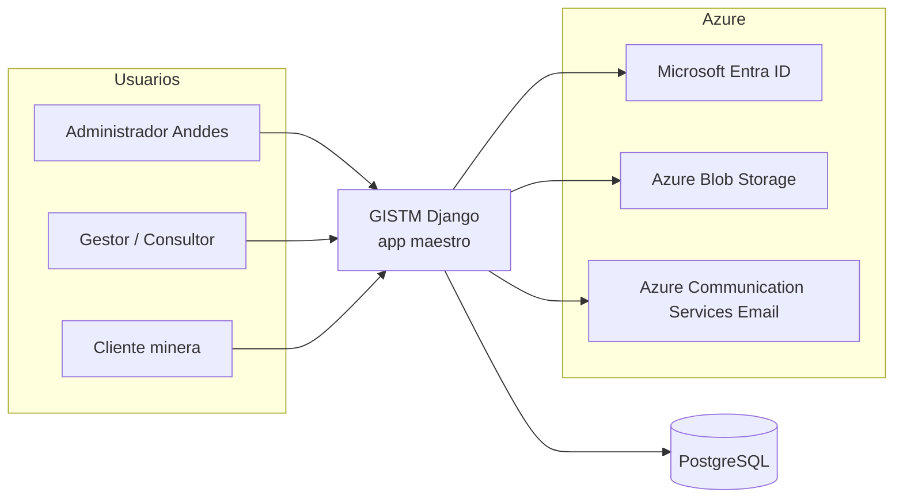

# Diagrama de contexto

```mermaid
flowchart LR
  subgraph Usuarios
    ADM[Administrador Anddes]
    GES[Gestor / Consultor]
    CLI[Cliente minera]
  end

  APP[GISTM Django<br/>app maestro]

  subgraph Azure
    ENTRA[Microsoft Entra ID]
    BLOB[Azure Blob Storage]
    ACS[Azure Communication Services Email]
  end

  PG[(PostgreSQL)]

  ADM --> APP
  GES --> APP
  CLI --> APP
  APP --> ENTRA
  APP --> PG
  APP --> BLOB
  APP --> ACS
```
