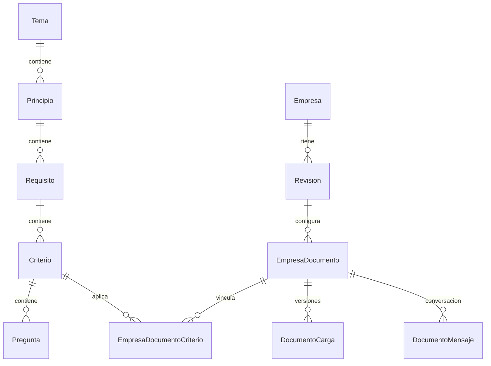

# Dominio: catálogo GISTM y revisión por empresa

```mermaid
erDiagram
  Tema ||--o{ Principio : contiene
  Principio ||--o{ Requisito : contiene
  Requisito ||--o{ Criterio : contiene
  Criterio ||--o{ Pregunta : contiene

  Empresa ||--o{ Revision : tiene
  Revision ||--o{ EmpresaDocumento : configura
  EmpresaDocumento ||--o{ EmpresaDocumentoCriterio : vincula
  Criterio ||--o{ EmpresaDocumentoCriterio : aplica
  EmpresaDocumento ||--o{ DocumentoCarga : versiones
  EmpresaDocumento ||--o{ DocumentoMensaje : conversacion
```
