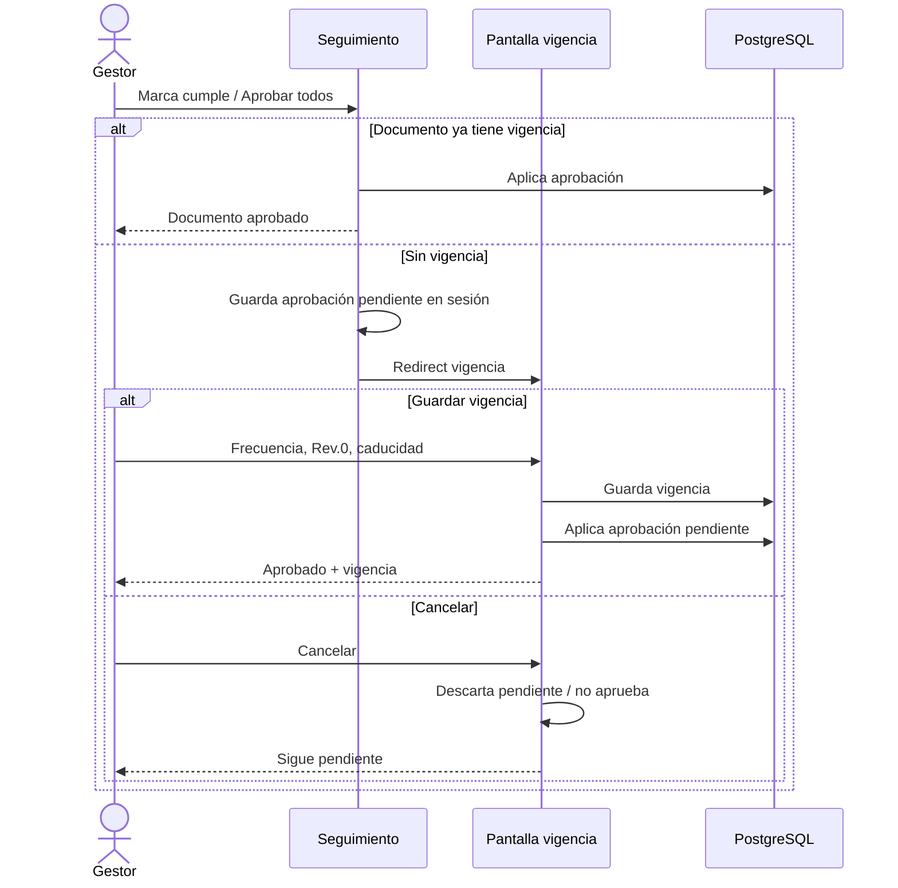

# Flujo: aprobación de evidencia y vigencia

```mermaid
sequenceDiagram
  actor G as Gestor
  participant S as Seguimiento
  participant V as Pantalla vigencia
  participant DB as PostgreSQL

  G->>S: Marca cumple / Aprobar todos
  alt Documento ya tiene vigencia
    S->>DB: Aplica aprobación
    S-->>G: Documento aprobado
  else Sin vigencia
    S->>S: Guarda aprobación pendiente en sesión
    S->>V: Redirect vigencia
    alt Guardar vigencia
      G->>V: Frecuencia, Rev.0, caducidad
      V->>DB: Guarda vigencia
      V->>DB: Aplica aprobación pendiente
      V-->>G: Aprobado + vigencia
    else Cancelar
      G->>V: Cancelar
      V->>V: Descarta pendiente / no aprueba
      V-->>G: Sigue pendiente
    end
  end
```
