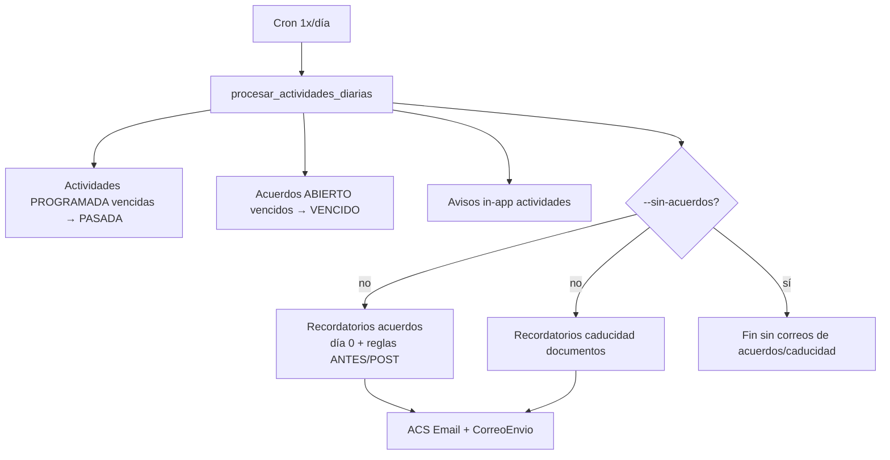

# Flujo: job diario `procesar_actividades_diarias`

```mermaid
flowchart TD
  A[Cron 1x/día] --> B[procesar_actividades_diarias]
  B --> C[Actividades PROGRAMADA vencidas → PASADA]
  B --> D[Acuerdos ABIERTO vencidos → VENCIDO]
  B --> E[Avisos in-app actividades]
  B --> F{--sin-acuerdos?}
  F -->|no| G[Recordatorios acuerdos<br/>día 0 + reglas ANTES/POST]
  F -->|no| H[Recordatorios caducidad documentos]
  F -->|sí| I[Fin sin correos de acuerdos/caducidad]
  G --> J[ACS Email + CorreoEnvio]
  H --> J
```
