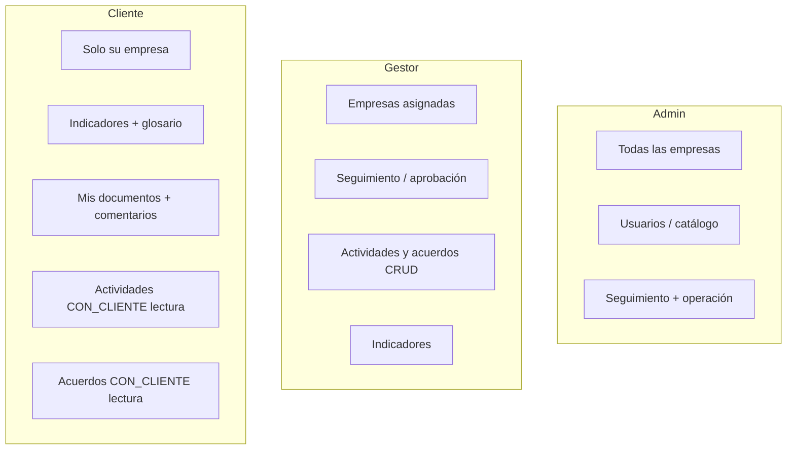

# Visibilidad por rol

```mermaid
flowchart TB
  subgraph Admin
    A1[Todas las empresas]
    A2[Usuarios / catálogo]
    A3[Seguimiento + operación]
  end

  subgraph Gestor
    G1[Empresas asignadas]
    G2[Seguimiento / aprobación]
    G3[Actividades y acuerdos CRUD]
    G4[Indicadores]
  end

  subgraph Cliente
    C1[Solo su empresa]
    C2[Indicadores + glosario]
    C3[Mis documentos + comentarios]
    C4[Actividades CON_CLIENTE lectura]
    C5[Acuerdos CON_CLIENTE lectura]
  end
```
